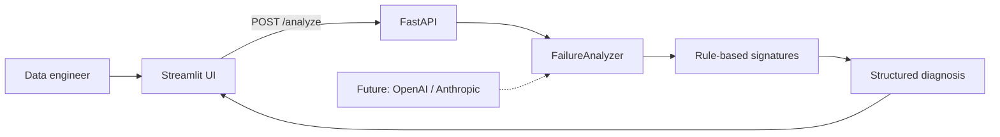

# Airflow AI Failure Analyzer

A demo-ready observability companion for Apache Airflow. Paste a failed task log to receive a failure category, severity, plain-language root cause, concise summary, and recommended next steps.

## Architecture



## Features

- Database, Snowflake, S3, memory, and Python exception diagnosis
- Severity assessment and concrete remediation steps
- One-click sample failures for quick demos
- A modular analyzer interface ready for LLM-powered analysis

## Run locally

```bash
python3 -m venv .venv
source .venv/bin/activate
pip install -r requirements.txt
uvicorn backend.main:app --reload
```

In another terminal:

```bash
source .venv/bin/activate
streamlit run frontend/app.py
```

Open http://localhost:8501.

## Future improvements

- LLM-powered root-cause analysis
- Historical DAG analytics
- Slack integration
- Airflow API integration
