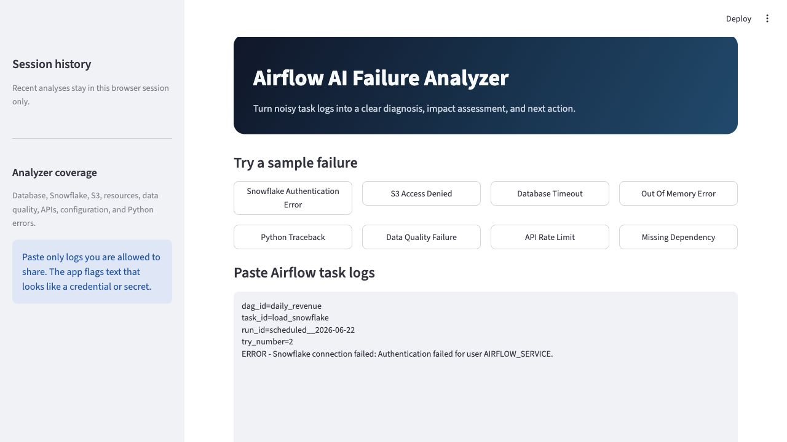
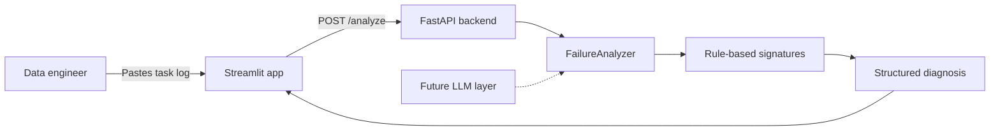

# Airflow AI Failure Analyzer

I built this as a small experiment in making Airflow failures easier to understand.

When a DAG task fails, engineers often have to scan a long log just to find the actual error. This app gives them a faster starting point. Paste in a task log and it returns a diagnosis, useful evidence, Airflow context, and a practical next action.



## What it does

The current analyzer recognizes common failures involving:

- Database connectivity
- Snowflake authentication and warehouses
- S3 access and missing objects
- Memory exhaustion
- Data quality checks
- External API failures and rate limits
- Missing dependencies or invalid configuration
- Python exceptions

It also extracts any available `dag_id`, `task_id`, `run_id`, and retry attempt from the log. It shows matched indicators, evidence lines, retry guidance, and flags text that might contain a secret.

## Architecture



The frontend sends a log to the FastAPI endpoint. The backend scores known signatures and returns a structured result. The current rules are intentionally transparent and easy to test. The `FailureAnalyzer` interface provides a clean place to add OpenAI or Anthropic later for unfamiliar logs.

## Features

- Evidence-based diagnosis with a transparent confidence score
- Parsed Airflow task context and a short incident summary
- Action checklist, retry guidance, and risk flags
- Downloadable JSON analysis and Markdown incident report
- Session-only analysis history
- One-click sample logs for an easy demo
- Automated test workflow through GitHub Actions

## Run locally

You need Python 3.11 or newer.

```bash
python3 -m venv .venv
source .venv/bin/activate
pip install -r requirements.txt
```

Start the backend in one terminal:

```bash
uvicorn backend.main:app --reload
```

Start the frontend in another terminal:

```bash
source .venv/bin/activate
streamlit run frontend/app.py
```

Open `http://localhost:8501`. The FastAPI docs are available at `http://localhost:8000/docs`.

## Run with Docker

If you have Docker Desktop installed, the whole app can be started with:

```bash
docker compose up --build
```

Then open `http://localhost:8501`.

## Example analysis

Given a log containing:

```text
dag_id=daily_revenue
task_id=load_snowflake
try_number=2
ERROR - Snowflake connection failed: Authentication failed for user AIRFLOW_SERVICE.
```

the app classifies it as a Snowflake failure. It shows the specific phrases that matched, identifies the task context, and suggests checking the connection, credentials, warehouse, and permissions.

## Project structure

```text
backend/                  FastAPI route, schemas, and analysis logic
frontend/                 Streamlit interface
tests/                    Tests for supported failure categories
.github/workflows/        GitHub Actions test workflow
DEMO.md                   Short presentation walkthrough
Dockerfile                Container image definition
docker-compose.yml        Runs the frontend and backend together
```

## Testing

Run the test suite locally:

```bash
python -m pytest -q
```

GitHub Actions runs the same tests whenever code is pushed or a pull request is opened.

## Design choices

This is rule-based before it is LLM-based on purpose. The rules make each result explainable: an engineer can see what the analyzer matched and why it recommended a next step. The confidence number describes how strongly the log matches a known signature; it is not a claim that the system has mathematically proven the root cause.

## Future improvements

- Pull task context directly from the Airflow API
- Learn from recurring failures across DAG runs
- Send a compact incident summary to Slack
- Add an LLM fallback for logs that do not match known signatures

## Why I built this

I’m interested in the small tools that make data-platform work less frustrating. This project is based on a simple idea: when something fails, engineers should be able to get to the useful part of the log faster.
