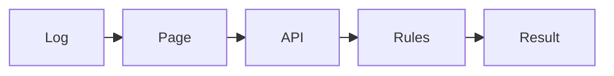

# Airflow AI Failure Analyzer

This is a small tool for checking Airflow task logs.

Paste in a failed task log. The app looks for known failure patterns, shows the matching lines, and gives you a short list of things to check.


## What it checks

- Database connections
- Snowflake access and warehouses
- S3 access and missing objects
- Memory limits
- Data quality errors
- API rate limits and service errors
- Kubernetes pod problems
- Disk and volume errors
- Missing packages and configuration issues
- Python exceptions

The app also reads `dag_id`, `task_id`, `run_id`, and retry attempts when they appear in the log.

## How it works



The frontend sends a log to the API. The backend checks it against a small set of rules and returns the result. Each result includes the words that matched, so it is easy to see why the app picked that category.

## Included features

- Match strength based on the number of matching phrases
- Lines from the log that support the result
- Parsed task details and a short status note
- Retry notes and warnings for repeated retries
- A reference ID for grouping similar failures
- Session history and simple session counts
- Downloadable JSON and Markdown reports
- Example logs for a quick demo

## Run locally

You need Python 3.11 or newer.

```bash
python3 -m venv .venv
source .venv/bin/activate
pip install -r requirements.txt
```

Start the API in one terminal:

```bash
uvicorn backend.main:app --reload
```

Start the page in another terminal:

```bash
source .venv/bin/activate
streamlit run frontend/app.py
```

Open `http://localhost:8501`. API docs are at `http://localhost:8000/docs`.

## Run with Docker

If Docker Desktop is installed:

```bash
docker compose up --build
```

Open `http://localhost:8501`.

## Example

```text
dag_id=daily_revenue
task_id=load_snowflake
try_number=2
ERROR - Snowflake connection failed: Authentication failed for user AIRFLOW_SERVICE.
```

This returns a Snowflake result, the phrases that matched, task details, and checks for the connection, credentials, warehouse, and permissions.

## Project files

```text
backend/                  API route, response models, and rule checks
frontend/                 Streamlit page
tests/                    Test suite
.github/workflows/        GitHub Actions test workflow
DEMO.md                   One-minute walkthrough
Dockerfile                Container image
docker-compose.yml        Starts the page and API together
```

## Testing

```bash
python -m pytest -q
```

GitHub Actions runs the same command on every push and pull request.

## Next steps

- Read task details directly from an Airflow deployment
- Track repeat failures across runs
- Send a short report to Slack
- Add more patterns as new logs come in
