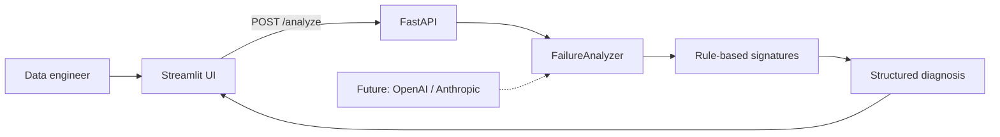

# Airflow AI Failure Analyzer

I built this as a small experiment in making Airflow failures easier to understand.

When a DAG task fails, engineers often have to scan a long log just to find the actual error. This app gives them a faster starting point.

## Architecture



## What it does

Paste an Airflow task log into the app. It looks for a few common failure patterns and returns an explanation of what may have gone wrong.

The current version recognizes:

- Database connection problems
- Snowflake authentication and warehouse issues
- S3 access errors and missing objects
- Out-of-memory failures
- Python exceptions

The result includes a severity level and suggested next steps.

## Run locally

```bash
python3 -m venv .venv
source .venv/bin/activate
pip install -r requirements.txt
uvicorn backend.main:app --reload
```

In another terminal:

```bash
source .venv/bin/activate
streamlit run frontend/app.py
```

Open http://localhost:8501.

## Future improvements

- LLM-powered root-cause analysis
- Historical DAG analytics
- Slack integration
- Airflow API integration
